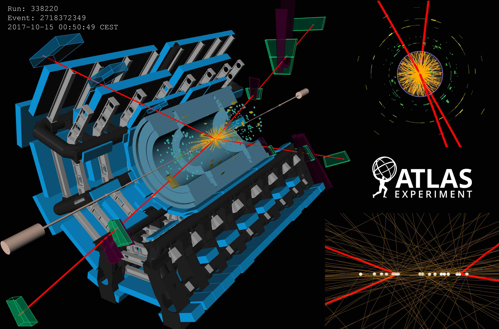
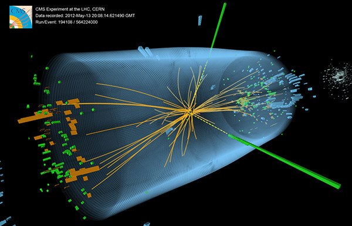

[ATLAS](https://atlas.cern/) and [CMS](https://cms.cern/collaboration) are both very cool physics collaborations, whose detectors are based at the [CERN](https://www.home.cern/) [LHC](https://www.home.cern/science/accelerators/large-hadron-collider). Their organizations are structurally similar, leading to groups, positions, and terms which have similar functions but somewhat different names. The purpose of the table below is to translate the names of these similarly functioning terms between the two collaborations.    

       

   

| Description | ATLAS | CMS | 
| ----------- | ----------- | ----------- |
| The group facilitating a certain physics topic| PA group | PAG | 
| Physics Coordination (cognate) | PC | PC |
| The group responsible for software modelling of physics processes. | PMG (Physics Modeling group) | GEN (Generator) | 
| The physics subgroup investigating the Higgs decaying into two photons | HGam | Hgg |
| The central software used by the above subgroup. | HGamCore | flashgg |
| The webpage meant to track the history and progress of a physics analysis | GLANCE | CADI | 
| The group which optimizes the tagging and calibration performance for different types of physics objects, and is responsible for the physics use, impact, and results of the object. | CP group (Combined performance group) | POG (Physics object group) | 
| A small committee which reviews a physics analysis. | EB (Editorial board) | ARC (Analysis review committee) | 
| Internal documentation with extra details for a given analysis. | INT note (Internal note) | AN (Analysis Note) |
| Circulation of a document draft through the entire collaboration for feedback. | ATLAS circulation | CWR (Collaboration Wide Review) |
| Group responsible for the preparation of data for physics analysis. Roughly the first "offline" step of data processing after "online" collection by the detector. | Data Preparation | PPD (Physics Performance and Datasets) |
| A public document released by the collaboration to make a result public, without submitting to a peer reviewed journal (typically to make a result public for a conference). | CONF note (Conference note) | PAS (Physics Analysis Summary) |
| The central software repository used to simulate the detector and its reconstruction algorithms. This software is crucial for processing data and simulation the same way for eventual comparison. | Athena | CMSSW | 
| The inital setup command for using the central detector software. | `setupATLAS` | `cmsenv` |
| Specific HLT triggers targetting different physics objects at LHC | Trigger chain | Trigger path |
| The subdetector responsible for measuring the luminosity delivered to the detector. | LUCID | BRIL | 
| The run coordination shifter who oversees the daily run operations. | Run Manager | Run Field Manager | 
| During HL-LHC, the **first** level of the trigger. | L0 | L1 |
| During HL-LHC, the **second** level of the trigger. | Event Filter | HLT |
| Credit given to collaborators to keep track of their detector work, typically required for authorship. | OTP (Operation Task planner) | EPR (Experimental Physics responsibilities) |
