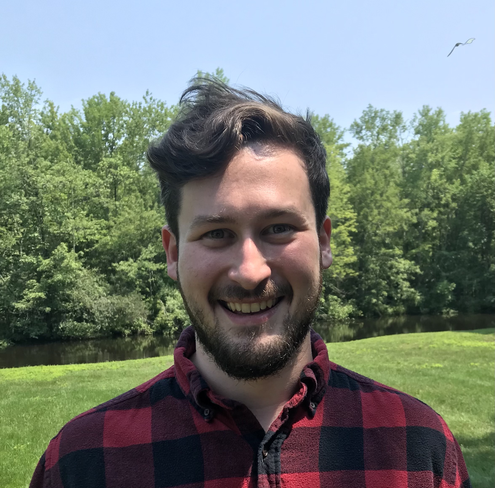
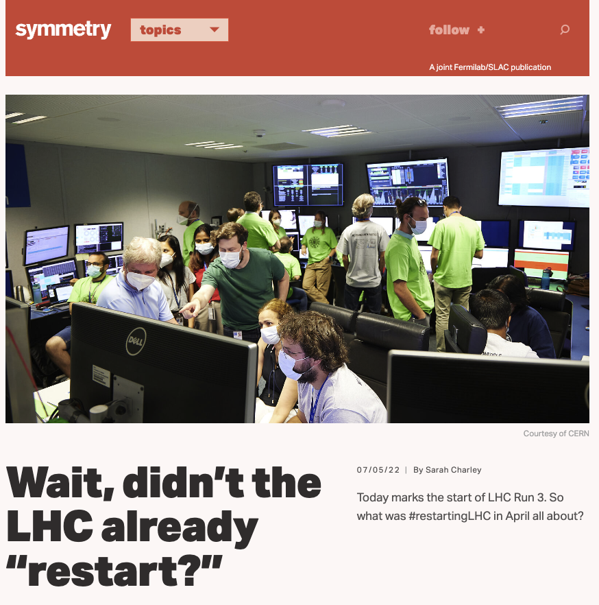
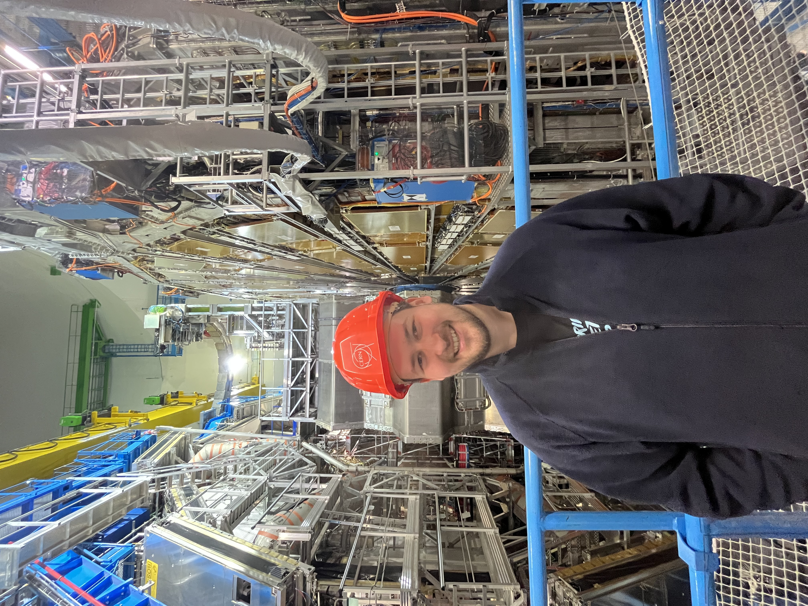
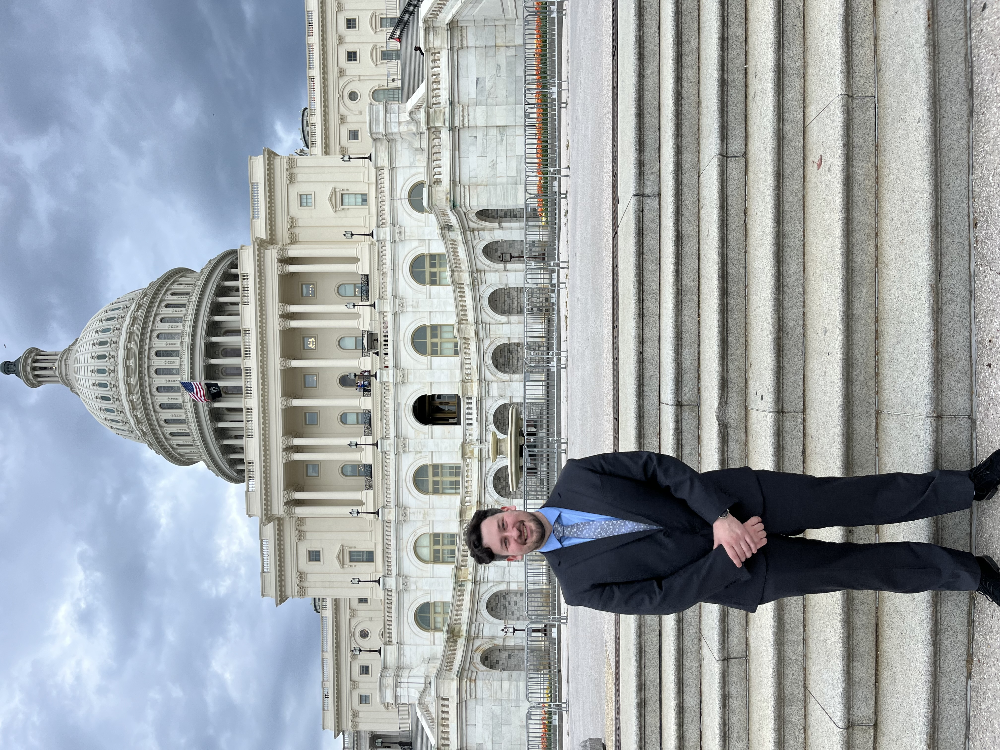
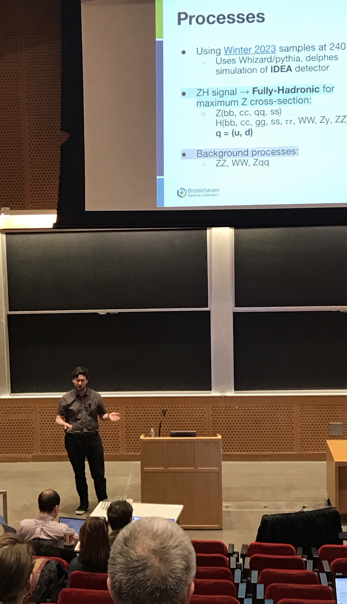
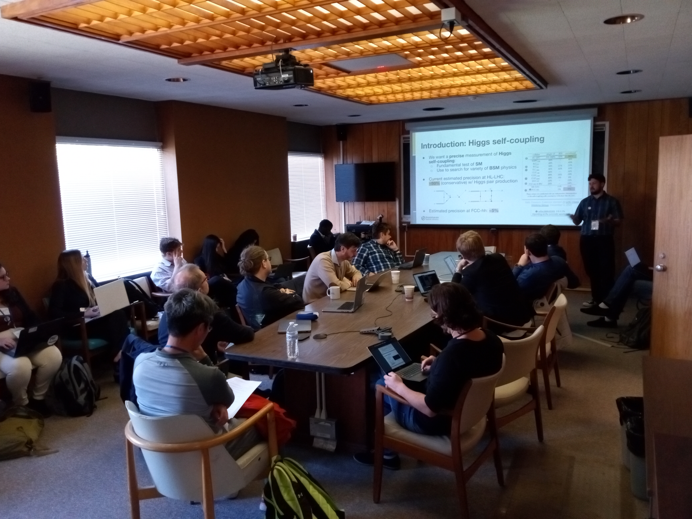
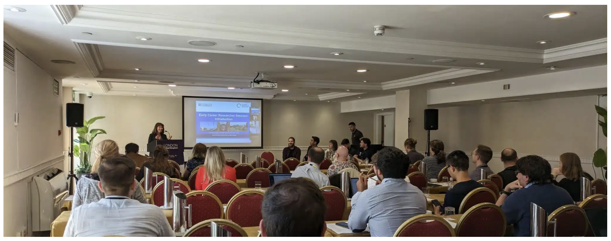

# Abraham Tishelman-Charny, PhD

Hello! My name is Abraham (Abe) Tishelman-Charny, and I am interested in physics, collaboration, and programming. I am currently a postdoctoral researcher with Brookhaven National Laboratory [[ref.]](https://www.bnl.gov/staff/atishelma) (2022-present), working as a part of the ATLAS collaboration on Higgs pair production and the assembly and testing of the ATLAS strip tracker upgrade (ITk). 

I obtained my PhD in experimental particle physics from Northeastern University (2016-2022), during most of which I was based at CERN in Geneva, Switzerland, working as a part of the CMS (Compact Muon Solenoid) collaboration. During my PhD at CERN, I led the analysis effort of the first LHC (Large Hadron Collider) Run 2 search of Higgs pair production in the two W boson, two photon final state at CMS, and coordinated the running activities of the CMS ECAL (Electromagnetic Calorimeter) during LS2 (Long Shutdown 2) and the start of LHC Run 3 as ECAL Run Coordinator (see below). I also performed various studies dedicated towards optimizing the CMS ECAL trigger primitive generation for LHC Run 3.

The purpose of this page is to store and share material related to my research. 

Email: `abraham.tishelman.charny@cern.ch`

## [Public Seminars and Talks](Pages/Seminars-and-talks.md)
## [Publications and public results](Pages/Publications-and-public-results.md)
## [ATLAS / CMS dictionary](Pages/ATLAS-CMS-Dictionary.md)

## Profiles

- [Link to CV](Documents/Abraham_Tishelman_Charny_CV.pdf)
- [Linkedin](https://www.linkedin.com/in/abraham-tishelman-charny-a4b977159/)
- [GitHub](https://github.com/atishelmanch)
- [GitLab](https://gitlab.cern.ch/atishelm)
- [arXiv](https://arxiv.org/search/physics?searchtype=author&query=Tishelman-Charny%2C+A)
- [ORCiD](https://orcid.org/0000-0002-7332-5098)
- [InspireHEP](https://inspirehep.net/authors/1684176)

## Pictures

<figure>

  <figcaption>5 July 2022: The start of LHC Run 3 in the CMS control room <a href="https://www.symmetrymagazine.org/article/wait-didnt-the-lhc-already-restart">[Sarah Charley: Symmetry Magazine]</a> </figcaption>
</figure>

   

  <figure style="height: 400px;">
    
    <figcaption>The CMS detector (and myself) during LHC LS2 (Long Shutdown 2)</figcaption>
  </figure>
   
  <figure style="height: 400px;">
    
    <figcaption>The ATLAS detector (and myself) in January 2024</figcaption>
  </figure>

   

<figure>

  <figcaption>April 2024: US HEP advocacy trip. </figcaption>
</figure>

   

<figure>

  <figcaption>October 2024: PIC 2024, Plenary session. </figcaption>
</figure>

   

<figure>

  <figcaption>April 2024: Second US-FCC workshop at MIT, plenary lightning talk session. </figcaption>
</figure>

   

<figure>

  <figcaption>April 2023: First US-FCC workshop at BNL, physics session. </figcaption>
</figure>

   

<figure>

  <figcaption>FCC week in London, July 2023, Early Career Researchers session. <a href="https://www.digital-science.com/tldr/article/cern-2070-the-next-generation/">[John Hammersley: Digital Science]</a> </figcaption>
</figure>

<head>
   <link rel="shortcut icon" type="image/x-icon" href="RabidBirdFavicon.ico">
</head>

I also like basketball: 


