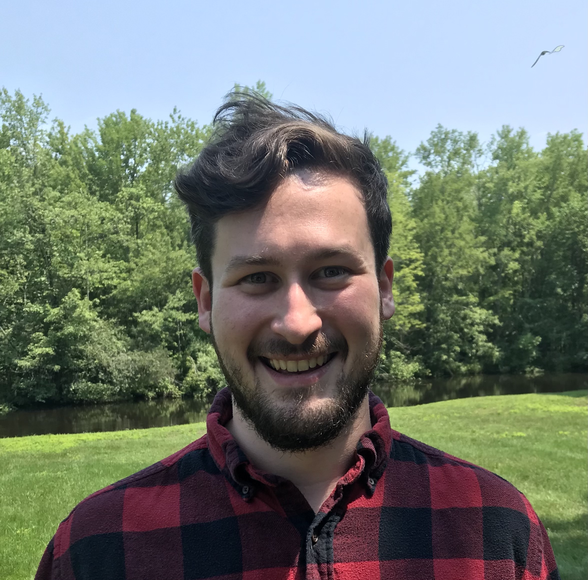

# Abraham Tishelman-Charny's website 

Hello! My name is Abraham (Abe) Tishelman-Charny. I am currently finishing up my PhD in experimental particle physics at Northeastern University, during which I worked on the CMS detector at the LHC. I will soon be starting a postdoctoral position at Brookhaven National Laboratory, to work on the ATLAS experiment. The purpose of this page is to store and share material related to my research. 

## Public seminars

Test.
